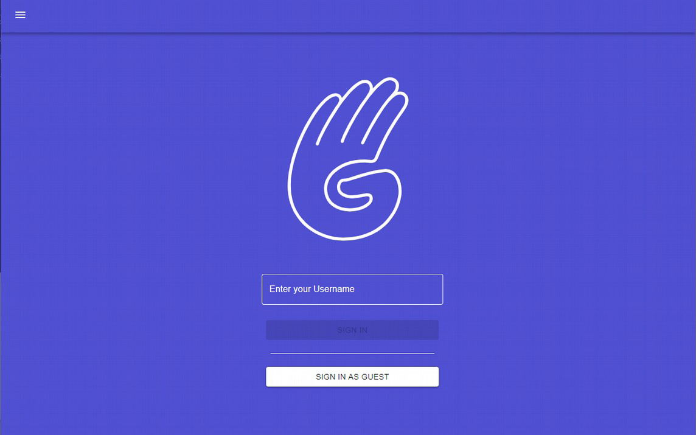
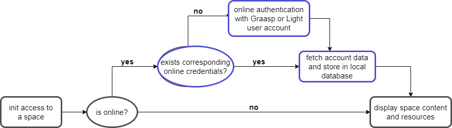

# User Authentication

Since Graasp Desktop v.0.15.4, a user authentication is available in order for multiple users to use the application.

The authentication process is triggered right at the launch of the application. It asks for a username before allowing access to the application. Each new username will create a corresponding user account on the fly. If a username already exists in the database, the user will sign in with the corresponding account and be able to access previously stored data.

One can use the application anonymously without restriction, but any saved data will not be retrievable after the user closes the session.

In order to automatically authenticate whenever the application is launched, the
current user session is stored in a dedicated part of the local storage and is used to sign
in. When the user signs out, the cached session is cleared and the application redirects
to the login screen.

## Alternative solution: Space-level Authentication (online)

Graasp offers a practical method for students to access spaces. From a link, before accessing a space, students create personal credentials, resulting in a Light account. This account allows to save data for this student for this space only.

If online data from Light users are required in Graasp Desktop, it is necessary to implement a authentication procedure triggered each time a space is visited.

However, as of today's requirements, Graasp Desktop is used in poorly connected countries. Trying to fetch data online is thus not necessary. Additionally, authenticating at a space-level is rather tedious and tends to be repetitive in a context where the user only consumes and visits spaces. Security should also be handled with high precautions.

The following schema depicts a proposed space-level login. Blue steps run while online, whereas grey steps are performed in an offline environment. If online, the application connects to and fetch the online account user data. If offline, the application skips the online procedure and immediately access the space.

